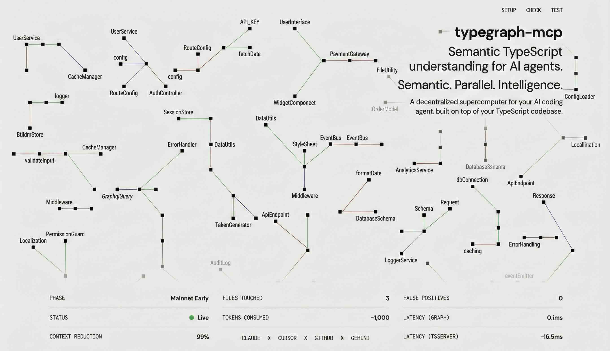

# typegraph-mcp

<p align="center">
  
</p>

Supercharge your AI coding agent with TypeScript superintelligence.

14 semantic navigation tools delivered via the [Model Context Protocol](https://modelcontextprotocol.io/) so any MCP-compatible agent can use them.

- **Instant type resolution** — hover info, generics, inferred types without reading files
- **Instant call tracing** — follow a symbol from handler to implementation in one call
- **Instant impact analysis** — "what breaks if I change this?" across the entire codebase
- **Instant dependency mapping** — what imports what, direct and transitive, by package
- **Instant cycle detection** — circular imports found in <1ms
- **Zero false positives** — semantic references, not string matches

## The problem

AI coding agents navigate TypeScript blind. They `grep` for a symbol name and get string matches instead of real references. They read entire files to find a type that's re-exported through three barrel files. They can't tell you what depends on what, or whether your refactor will break something two packages away.

Every wrong turn burns context tokens and degrades the agent's output.

## The difference

Measured on a real 440-file TypeScript monorepo:

| | grep | typegraph-mcp |
|---|---|---|
| **Context tokens** | ~113,000 | 1,006 |
| **Files touched** | 47 | 3 |
| **False positives** | dozens | 0 |
| **Barrel file resolution** | reads 6 files, still guessing | 1 tool call, exact source |
| **Cross-package impact** | 1,038 string matches | 31 direct + 158 transitive, by package |
| **Circular dependency detection** | impossible | instant |
| **Avg latency (semantic)** | n/a | 16.9ms |
| **Avg latency (graph)** | n/a | 0.1ms |

**99% context reduction. 100% accuracy. [Full benchmarks](./BENCHMARKS.md).**

### Before: grep-based navigation

```
Agent: I need to find where createUser is implemented.
  → grep "createUser" across project
  → 47 results: test files, comments, variable names, string literals, actual definitions
  → reads 6 files trying to follow the chain
  → burns ~113,000 tokens, still not sure it found the right implementation
```

### After: typegraph-mcp

```
Agent: ts_trace_chain({ file: "src/handlers.ts", symbol: "createUser" })
  → 3-hop chain: handlers.ts → UserService.ts → UserRepository.ts
  → each hop shows the exact line with a code preview
  → 1,006 tokens, done
```

## Quick start

### Step 1: Install

```bash
cd /path/to/your-ts-project
npx typegraph-mcp setup
```

The interactive setup auto-detects your AI agents, installs the plugin into `./plugins/typegraph-mcp/`, registers the MCP server, copies workflow skills, appends agent instructions, and runs verification. Use `--yes` to skip prompts.

### Step 2: Launch your agent

**Claude Code** — load the plugin for the full experience:

```bash
claude --plugin-dir ./plugins/typegraph-mcp
```

This gives you 14 MCP tools, 5 workflow skills that teach Claude *when* and *how* to chain tools, `/typegraph:check`, `/typegraph:test`, and `/typegraph:bench` slash commands, and a SessionStart hook for dependency verification.

**Other agents** (Cursor, Codex CLI, Gemini CLI, GitHub Copilot) — restart your agent session. The MCP server and skills are already configured.

For **Codex CLI**, setup now writes a project-local `.codex/config.toml` entry using absolute paths so the tools stay scoped to the project and still work when Codex launches from a subdirectory.

First query takes ~2s (tsserver warmup). Subsequent queries: 1-60ms.

## Requirements

- **Node.js** >= 22
- **TypeScript** >= 5.0 in the target project
- **npm** for dependency installation

## Tools

### Semantic queries (tsserver)

| Tool | Description |
|---|---|
| `ts_find_symbol` | Find a symbol's location in a file by name |
| `ts_definition` | Go to definition — resolves through imports, re-exports, barrel files, generics |
| `ts_references` | Find all semantic references (not string matches) |
| `ts_type_info` | Get type and documentation — same as VS Code hover |
| `ts_navigate_to` | Search for a symbol across the entire project |
| `ts_trace_chain` | Follow definition hops automatically, building a call chain |
| `ts_blast_radius` | Analyze impact of changing a symbol — all usage sites and affected files |
| `ts_module_exports` | List all exports from a module with resolved types |

### Import graph queries (oxc-parser + oxc-resolver)

| Tool | Description |
|---|---|
| `ts_dependency_tree` | Transitive dependency tree of a file |
| `ts_dependents` | All files that depend on a given file, grouped by package |
| `ts_import_cycles` | Detect circular import dependencies |
| `ts_shortest_path` | Shortest import path between two files |
| `ts_subgraph` | Extract the neighborhood around seed files |
| `ts_module_boundary` | Analyze module coupling: incoming/outgoing edges, isolation score |

## CLI

```
typegraph-mcp <command> [options]

  setup    Install plugin into the current project
  remove   Uninstall from the current project
  check    Run 12 health checks
  test     Smoke test all 14 tools
  bench    Run benchmarks (token, latency, accuracy)
  start    Start the MCP server (stdin/stdout)

  --yes    Skip prompts     --help    Show help
```

## Troubleshooting

Run the health check first — it catches most issues:

```bash
npx typegraph-mcp check
```

| Symptom | Fix |
|---|---|
| Server won't start | `cd plugins/typegraph-mcp && npm install --include=optional` |
| "TypeScript not found" | Run `pnpm install` or `npm install`; if TypeScript is not declared, add it to devDependencies first |
| Tools return empty results | Check `TYPEGRAPH_TSCONFIG` points to the right tsconfig |
| Build errors from plugins/ | Add `"plugins/**"` to tsconfig.json `exclude` array |
| `@esbuild/*` or `@rollup/*` package missing | Reinstall with Node 22: `npm install --include=optional` |
| "npm warn Unknown project config" | Safe to ignore — caused by pnpm settings in your `.npmrc` that npm doesn't recognize |

## Manual MCP configuration

### Codex CLI

Add this to your project's `.codex/config.toml`:

```toml
[mcp_servers.typegraph]
command = "/absolute/path/to/your-project/plugins/typegraph-mcp/node_modules/.bin/tsx"
args = ["/absolute/path/to/your-project/plugins/typegraph-mcp/server.ts"]
env = { TYPEGRAPH_PROJECT_ROOT = "/absolute/path/to/your-project", TYPEGRAPH_TSCONFIG = "/absolute/path/to/your-project/tsconfig.json" }
```

Using the plugin-local `tsx` binary avoids relying on `npx tsx` being resolvable when Codex launches the MCP server.

Codex only loads project `.codex/config.toml` files for trusted projects. If needed, add this to `~/.codex/config.toml`:

```toml
[projects."/absolute/path/to/your-project"]
trust_level = "trusted"
```

### JSON-based MCP clients

Add to `.claude/mcp.json` (or `~/.claude/mcp.json` for global):

```json
{
  "mcpServers": {
    "typegraph": {
      "command": "npx",
      "args": ["tsx", "/absolute/path/to/typegraph-mcp/server.ts"],
      "env": {
        "TYPEGRAPH_PROJECT_ROOT": ".",
        "TYPEGRAPH_TSCONFIG": "./tsconfig.json"
      }
    }
  }
}
```

`TYPEGRAPH_PROJECT_ROOT` resolves relative to the agent's working directory. The `args` path to `server.ts` must be absolute.

## How it works

```
AI Agent ─── stdin/stdout ─── MCP Server ─┬── tsserver (child process)
              MCP protocol                │     type-aware point queries
                                          └── module-graph (in-process)
                                                oxc-parser + oxc-resolver
                                                structural graph queries
```

Two subsystems start concurrently:

1. **tsserver** — child process for semantic queries. Communicates via pipes using tsserver's JSON protocol. Auto-restarts on crash (up to 3 times).

2. **Module graph** — in-process import graph built with [oxc-parser](https://github.com/nicolo-ribaudo/oxc-parser) and [oxc-resolver](https://github.com/nicolo-ribaudo/oxc-resolver). Incrementally updated via `fs.watch`.

**Monorepo support** — resolves through `composite` project references, maps `dist/` back to source, handles `extensionAlias` for `.js` → `.ts` mapping, and follows cross-package barrel re-exports.

## Contributing

### Setup from source

```bash
git clone https://github.com/guyowen/typegraph-mcp.git
cd typegraph-mcp
nvm use
npm install --include=optional
```

### Run locally against a project

```bash
cd /path/to/your-ts-project
npx tsx ~/typegraph-mcp/cli.ts setup
```

Or start the MCP server directly:

```bash
TYPEGRAPH_PROJECT_ROOT=/path/to/project TYPEGRAPH_TSCONFIG=/path/to/project/tsconfig.json npx tsx ~/typegraph-mcp/server.ts
```

### Load as a Claude Code plugin (from source)

```bash
claude --plugin-dir ~/typegraph-mcp
```

### Verify your changes

```bash
npx tsx ~/typegraph-mcp/cli.ts check    # 12 health checks
npx tsx ~/typegraph-mcp/cli.ts test     # smoke test all 14 tools
```

### Build compiled output

```bash
npm run build    # compiles to dist/ via tsup
```

### Branch workflow

- **`dev`** — all work happens here
- **`main`** — merge to main triggers CI: auto-bumps patch version, publishes to npm via OIDC trusted publishers

## Known limitations

- **Object literal property keys** (e.g., RPC handler names) are not indexed by tsserver's `navto`. Use `ts_find_symbol` with a specific file, or pass the `file` hint to `ts_navigate_to`.
- **First query latency** — ~2s as tsserver loads the project. Subsequent queries: 1-60ms.
- **Memory** — tsserver holds the project in memory. For very large monorepos (1000+ files), expect ~200-500MB RSS.
